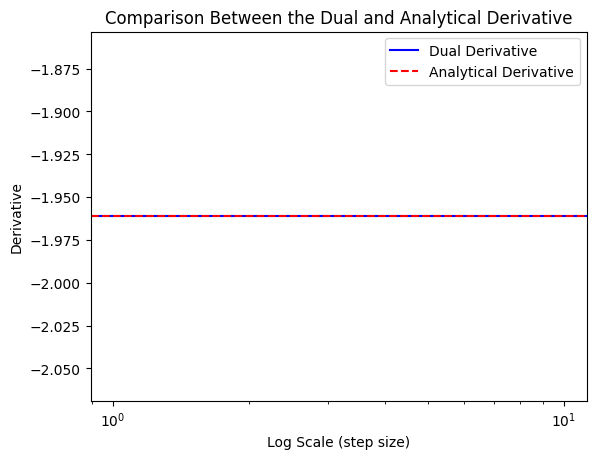
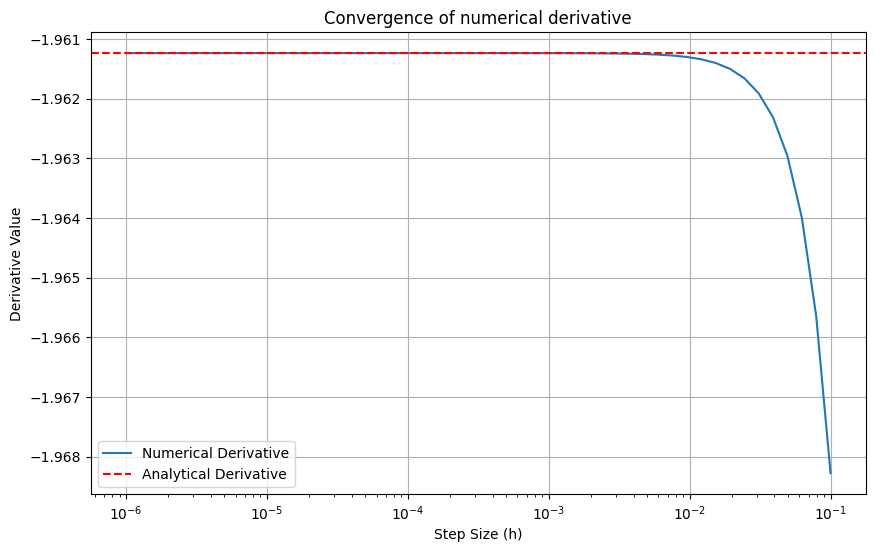
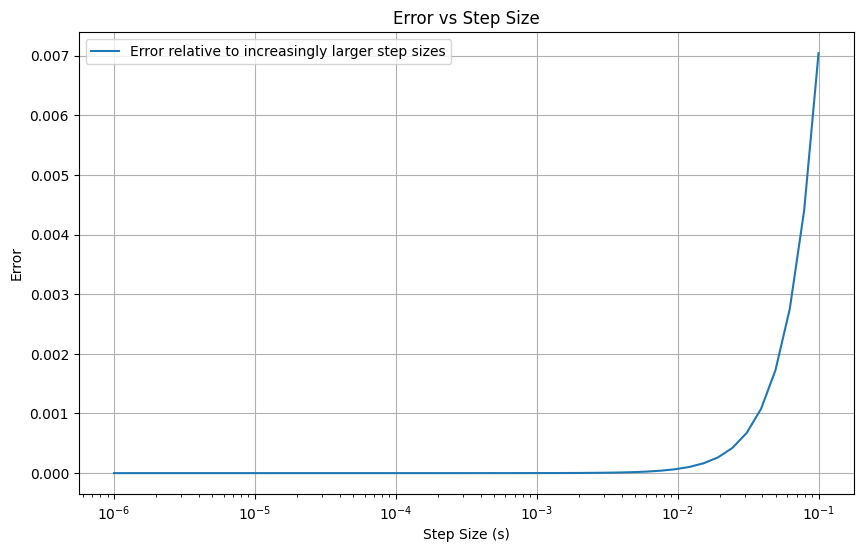
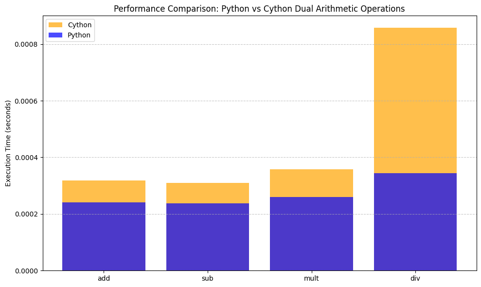
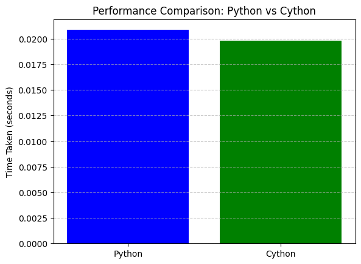

Q5 + Q9 Notebook
================

.. code:: ipython3

    from dual_autodiff.dual import Dual as pydual 
    from dual_autodiff_x.dual_autodiff_x.dual import Dual as cydual 

.. code:: ipython3

    import math
    import matplotlib.pyplot as plt
    import numpy as np
    from dual_autodiff.q.q5 import * 
    import timeit
    from timeit import Timer
    from memory_profiler import memory_usage

Given the function:

f(x) = log(sin(x)) + x^2cos(x)

We are computing the derivative using three different methods:

1. Dual Numbers: Employing dual numbers to calculate the derivative.

2. Analytical Derivative: Deriving the derivative directly using
   calculus.

3. Numerical Derivative: Estimating the derivative using a numerical
   approximation method.

.. code:: ipython3

    x = 1.5
    
    dual_value = dual_function_derivative(x)
    analytical_value = analytical_derivative(x)
    
    #varying numerical values:
    numerical_value = numerical_derivative(x, 0.01)
    numerical_value2 = numerical_derivative(x, 0.001)
    numerical_value3 = numerical_derivative(x, 0.0001)
    
    print(f"Dual Number Value: {dual_value}")
    print(f"Analytical Derivative: {analytical_value}")
    print(f"Numerical Derivative (s = 0.01): {numerical_value}")
    print(f"Numerical Derivative (s = 0.001): {numerical_value2}")
    print(f"Numerical Derivative (s = 0.0001): {numerical_value3}")
    
    print("dual real", dual_value.dual)

.. parsed-literal::

    Dual Number Value: Dual(real = 0.15665054756073515, dual = -1.9612372705533612)
    Analytical Derivative: -1.9612372705533612
    Numerical Derivative (s = 0.01): -1.9613078471950178
    Numerical Derivative (s = 0.001): -1.9612379763359749
    Numerical Derivative (s = 0.0001): -1.9612372776108
    dual real -1.9612372705533612

Based on these derivative results, we observe that the derivative
calculated using dual numbers closely aligns with both the analytical
and numerical derivatives. To gain deeper insights, we can visualized
the comparison:

.. code:: ipython3

    dual_d = dual_value.dual
    plt.axhline(y = dual_d, color = 'b', linestyle = '-', label = "Dual Derivative")
    plt.axhline(y = analytical_value, color = 'r', linestyle = '--', label = "Analytical Derivative")
    plt.title("Comparison Between the Dual and Analytical Derivative")
    plt.xscale('log')
    plt.xlabel('Log Scale (step size)')
    plt.ylabel('Derivative')
    plt.legend()
    plt.show()

In this graph we can see that the analytical derivative and derivative
calculated using dual numers share the same outcome. This outcome
indicates the validity of the dual number approach for derivative
computation. Since the analytical derivative is derived using exact math
principles, its agreement with the dual number result confirms that dual
numbers provide accurate and reliable derivative calculations.

.. code:: ipython3

    s_values = np.logspace(-6, -1, 50)
    numerical_values = [numerical_derivative(x, s) for s in s_values]
    errors = [abs(num - analytical_value) for num in numerical_values]
    
    plt.figure(figsize=(10, 6))
    plt.plot(s_values, numerical_values, label='Numerical Derivative')
    plt.axhline(y = analytical_value, color = 'r', linestyle = '--', label = 'Analytical Derivative')
    plt.xscale('log')
    plt.xlabel('Step Size (h)')
    plt.ylabel('Derivative Value')
    plt.title("Convergence of numerical derivative")
    plt.legend()
    plt.grid(True)
    plt.show()
    
    plt.figure(figsize=(10, 6))
    plt.plot(s_values, errors, label = 'Error relative to increasingly larger step sizes')
    plt.xscale('log')
    plt.xlabel('Step Size (s)')
    plt.ylabel('Error')
    plt.title("Error vs Step Size")
    plt.legend()
    plt.grid(True)
    plt.show()

These graphs demonstrate that as the numerical step size increases, the
error rate grows, following an exponential trend. This indicates that
smaller step sizes yield results that align much closer to the
analytical derivative, whereas larger step sizes introduce greater
discrepancies.

In this upcoming code we will compare the performance of the python
dual_autodiff package and the cythonized dual_autodiff package,
dual_autodiff_x:

.. code:: ipython3

    def py_add(a, b):
        return a + b
    
    def py_sub(a, b):
        return a - b
    
    def py_mult(a, b):
        return a * b
    
    def py_div(a, b):
        return a / b
    
    def cy_add(a, b):
        return a + b
    
    def cy_sub(a, b):
        return a - b
    
    def cy_mult(a, b):
        return a * b
    
    def cy_div(a, b):
        return a / b
    
    py_a, py_b = pydual(2, 3), pydual(3, 4)
    cy_a, cy_b = cydual(2, 3), cydual(3, 4)
    
    operations = ["add", "sub", "mult", "div"]
    py_functions = [py_add, py_sub, py_mult, py_div]
    cy_functions = [cy_add, cy_sub, cy_mult, cy_div]
    
    py_time = []
    cy_time = []
    
    for func in py_functions:
        timer = timeit.Timer(lambda: func(py_a, py_b))
        py_time.append(timer.timeit(number=1000))
    
    
    for func in cy_functions:
        timer = timeit.Timer(lambda: func(cy_a, cy_b))
        cy_time.append(timer.timeit(number=1000))
    
    for operation, py_t, cy_t in zip(operations, py_time, cy_time):
        difference = py_t - cy_t 
        print(f"Time difference for {operation}: {difference} seconds")

.. parsed-literal::

    Time difference for add: -6.874901009723544e-05 seconds
    Time difference for sub: -7.095799082890153e-05 seconds
    Time difference for mult: -9.450002107769251e-05 seconds
    Time difference for div: -0.00035987497540190816 seconds

.. code:: ipython3

    operations = ["add", "sub", "mult", "div"]
    plt.figure(figsize=(10, 6))
    plt.bar(operations, cy_time, label="Cython", color="orange", alpha = 0.7) 
    plt.bar(operations, py_time, label="Python", color="blue", alpha = 0.7)
    plt.ylabel("Execution Time (seconds)")
    plt.title("Performance Comparison: Python vs Cython Dual Arithmetic Operations")
    plt.legend()
    plt.grid(axis="y", linestyle="--", alpha=0.7)
    plt.tight_layout()
    plt.show()

Cython is slower in this case because the Dual class and its operations
still rely on python’s dynamic type system and special methods (**add**,
**mul**, **sub**, **div**). While cython compiles the code into C, it
still interacts with python objects at runtime. This interaction
includes dynamic type checking, memory management, and special method
calls, which all introduce python level overhead that cython cannot
bypass without explicit typecasting or translation to pure C-based code.
Additionally, each operation with the dual class involves the creation
of new dual objects, which creates python level object initialization
overhead which further limits cython’s performance advantages.

Cython does well with tasks that are computation heavy; such as
numerical array manipulations or matrix operations, where python’s
runtime overhead is minimized and C code optimization can be fully
utilized. However, in this case, implementation involves frequent python
object interactions and method dispatching which limits cython’s
potential performance improvements. This outcome showcases the
importance of explicit static typing and restructuring object oriented
code for cython to get the best performance possible.

Here is a nested loop example:

.. code:: ipython3

    def poly_eval_py():
        x = pydual(2, 1)
        result = pydual(0, 0)
        for i in range(1, 1000):
            result += x**i
        return result
    
    def poly_eval_cy():
        x = cydual(2, 1)
        result = cydual(0, 0)
        for i in range(1, 1000):
            result += x**i
        return result
    
    py_timer = Timer(poly_eval_py)
    cy_timer = Timer(poly_eval_cy)
    py_time = py_timer.timeit(number=10)
    cy_time = cy_timer.timeit(number=10)
    
    print(cy_time - py_time)

.. parsed-literal::

    0.0008500409894622862

.. code:: ipython3

    labels = ["Python", "Cython"]
    times = [py_time, cy_time]
    plt.bar(labels, times, color=['blue', 'green'])
    plt.ylabel('Time Taken (seconds)')
    plt.title('Performance Comparison: Python vs Cython')
    plt.grid(axis = 'y', linestyle = '--' , alpha = 0.7)

Although the .pyx file was not typecast, this visual demonstrates that
Cython is still more optimized than python when executing nested loops.
This is primarily because Python loops incur runtime overhead due to
dynamic type checking, which involves verifying the type of each
variable at runtime during each iteration. In contrast, Cython compiles
the code into C, eliminating the need for runtime type checking by using
static typing which streamlines loop execution.

Additionally, python’s range function introduces more overhead by
creating iterator that keeps track of its progress during each loop
iteration. However, cython translates loops directly into C-style for
loops which execute faster because they don’t have extra overhead. These
optimizations make cython a more efficient choice for computationally
expensive tasks involving nested loops.
