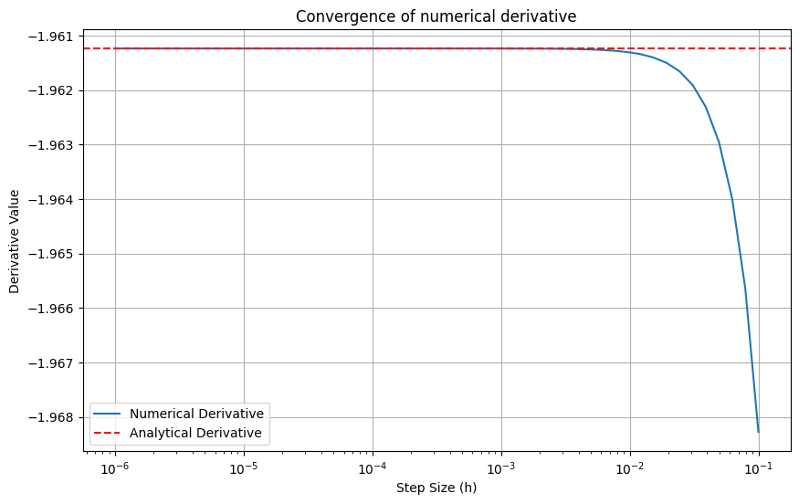
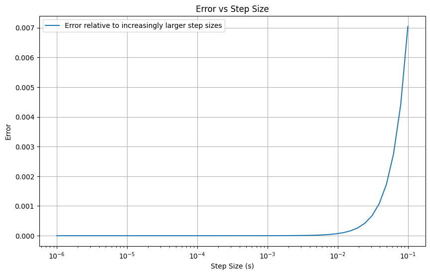

Q5 and Q9
=========

.. code:: ipython3

    from dual_autodiff.dual_autodiff.dual import Dual as pydual
    import sys
    sys.path.append('/Users/lilyrausser')
    from dual_autodiff_x.dual_autodiff.dual_autodiff.dual import Dual as cydual

.. parsed-literal::

    dual_autodiff package version: 0.0.1.post1
    dual_autodiff package version: 0.0.1.post1

.. code:: ipython3

    import math
    import matplotlib.pyplot as plt
    import numpy as np
    sys.path.append('/Users/lilyrausser/dual_autodiff')
    from dual_autodiff.q.q5 import * 
    import timeit
    from timeit import Timer
    from memory_profiler import memory_usage

Here we have a few functions that we have derived from our Dual class
from the dual_autodiff package:

1. dual_function_derivative: computes the derivate of the function at a
   specific value of x using dual numbers

2. analytical_derivative: computes the analytical derivate of the
   function at a specific value of x using calculus functions

3. numerical_derivative: computes the umerical derivative of the
   function at a specific value of x using an increasingly smaller step
   size

Given the function: f(x) = log(sin(x)) + x^2cos(x), compute the
derivative using dual numbers in addition to the analytical and
numerical derivative

.. code:: ipython3

    x = 1.5
    
    dual_value = dual_function_derivative(x)
    analytical_value = analytical_derivative(x)
    
    #varying numerical values:
    numerical_value = numerical_derivative(x, 0.01)
    numerical_value2 = numerical_derivative(x, 0.001)
    numerical_value3 = numerical_derivative(x, 0.0001)
    
    print(f"Dual Number Value: {dual_value}")
    print(f"Analytical Derivative: {analytical_value}")
    print(f"Numerical Derivative (s = 0.01): {numerical_value}")
    print(f"Numerical Derivative (s = 0.001): {numerical_value2}")
    print(f"Numerical Derivative (s = 0.0001): {numerical_value3}")
    
    print("dual real", dual_value.dual)

.. parsed-literal::

    Dual Number Value: Dual(real = 0.15665054756073515, dual = -1.9612372705533612)
    Analytical Derivative: -1.9612372705533612
    Numerical Derivative (s = 0.01): -1.9613078471950178
    Numerical Derivative (s = 0.001): -1.9612379763359749
    Numerical Derivative (s = 0.0001): -1.9612372776108
    dual real -1.9612372705533612

From these derivative results, we can see that the function derivative
calculation that utilizes dual numbers has a very similar output to that
of the analytical and numerical derivative. Let’s visualize this to have
a better understanding:

.. code:: ipython3

    dual_d = dual_value.dual
    plt.axhline(y = dual_d, color = 'b', linestyle = '-', label = "Dual Derivative")
    plt.axhline(y = analytical_value, color = 'r', linestyle = '--', label = "Analytical Derivative")
    plt.title("Comparison Between the Dual and Analytical Derivative")
    plt.xscale('log')
    plt.xlabel('Log Scale (step size)')
    plt.ylabel('Derivative')
    plt.legend()
    plt.show()

.. image:: ../docs/dual_autodiff_files/dual_autodiff_21_0.png

.. code:: ipython3

    s_values = np.logspace(-6, -1, 50)
    numerical_values = [numerical_derivative(x, s) for s in s_values]
    errors = [abs(num - analytical_value) for num in numerical_values]
    
    plt.figure(figsize=(10, 6))
    plt.plot(s_values, numerical_values, label='Numerical Derivative')
    plt.axhline(y = analytical_value, color = 'r', linestyle = '--', label = 'Analytical Derivative')
    plt.xscale('log')
    plt.xlabel('Step Size (h)')
    plt.ylabel('Derivative Value')
    plt.title("Convergence of numerical derivative")
    plt.legend()
    plt.grid(True)
    plt.show()
    
    plt.figure(figsize=(10, 6))
    plt.plot(s_values, errors, label = 'Error relative to increasingly larger step sizes')
    plt.xscale('log')
    plt.xlabel('Step Size (s)')
    plt.ylabel('Error')
    plt.title("Error vs Step Size")
    plt.legend()
    plt.grid(True)
    plt.show()

Q9: Compare the performance of the pure python version and the
cythonized python version:

1. Do you observe a performance difference?
2. if so, why or why not?

\*\* must be a quantitative answer and include plots to illustrate
observations and conclusions

.. code:: ipython3

    
    operation = "Dual(2, 1) + Dual(3, 2)"
    py_setup = "from dual_autodiff.dual_autodiff.dual import Dual"
    cy_setup = "from dual_autodiff_x.dual_autodiff.dual_autodiff.dual import Dual"
    
    timer = Timer(operation, py_setup)
    time_taken = timer.timeit(number = 10000)
    print("Python Time taken in seconds to run: ", time_taken)
    
    cy_timer = Timer(operation, cy_setup)
    cy_time_taken = timer.timeit(number = 10000)
    print("Cython time taken in seconds to run: ", cy_time_taken)
    
    speed_diff = time_taken / cy_time_taken
    print("Speed Diff. :", speed_diff)

.. parsed-literal::

    Python Time taken in seconds to run:  0.0054478340316563845
    Cython time taken in seconds to run:  0.004581458051688969
    Speed Diff. : 1.189104859237557

.. code:: ipython3

    operation = "Dual(2, 1) * Dual(3, 2)"
    py_setup = "from dual_autodiff.dual_autodiff.dual import Dual"
    cy_setup = "from dual_autodiff_x.dual_autodiff.dual_autodiff.dual import Dual"
    
    timer = Timer(operation, py_setup)
    time_taken = timer.timeit(number = 10000)
    print("Python Time taken in seconds to run: ", time_taken)
    
    cy_timer = Timer(operation, cy_setup)
    cy_time_taken = timer.timeit(number = 10000)
    print("Cython time taken in seconds to run: ", cy_time_taken)
    
    speed_diff = time_taken / cy_time_taken
    print("Speed Diff. :", speed_diff)

.. parsed-literal::

    Python Time taken in seconds to run:  0.006548792007379234
    Cython time taken in seconds to run:  0.0056671249913051724
    Speed Diff. : 1.1555757138631608

.. code:: ipython3

    operation = "Dual(2, 1) - Dual(3, 2)"
    py_setup = "from dual_autodiff.dual_autodiff.dual import Dual"
    cy_setup = "from dual_autodiff_x.dual_autodiff.dual_autodiff.dual import Dual"
    
    timer = Timer(operation, py_setup)
    time_taken = timer.timeit(number = 10000)
    print("Python Time taken in seconds to run: ", time_taken)
    
    cy_timer = Timer(operation, cy_setup)
    cy_time_taken = timer.timeit(number = 10000)
    print("Cython time taken in seconds to run: ", cy_time_taken)
    
    speed_diff = time_taken / cy_time_taken
    print("Speed Diff. :", speed_diff)

.. parsed-literal::

    Python Time taken in seconds to run:  0.0058263749815523624
    Cython time taken in seconds to run:  0.00533470802474767
    Speed Diff. : 1.0921637987540938

Convergence example

.. code:: ipython3

    # x = pydual(1, 1)
    # f = x * pydual.cos(x)
    
    operation = "Dual(1, 1) * Dual.cos(Dual(1, 1))"
    py_setup = "from dual_autodiff.dual_autodiff.dual import Dual"
    cy_setup = "from dual_autodiff_x.dual_autodiff.dual_autodiff.dual import Dual"
    
    timer = Timer(operation, py_setup)
    time_taken = timer.timeit(number = 10000)
    print("Python Time taken in seconds to run: ", time_taken)
    
    cy_timer = Timer(operation, cy_setup)
    cy_time_taken = timer.timeit(number = 10000)
    print("Cython time taken in seconds to run: ", cy_time_taken)
    
    speed_diff = time_taken / cy_time_taken
    print("Speed Diff. :", speed_diff)

.. parsed-literal::

    Python Time taken in seconds to run:  0.011730915983207524
    Cython time taken in seconds to run:  0.009505624999292195
    Speed Diff. : 1.2341025428713028

Chain rule example:

.. code:: ipython3

    operation = "Dual.log(Dual.exp(Dual(1, 1)))"
    py_setup = "from dual_autodiff.dual_autodiff.dual import Dual"
    cy_setup = "from dual_autodiff_x.dual_autodiff.dual_autodiff.dual import Dual"
    
    timer = Timer(operation, py_setup)
    time_taken = timer.timeit(number = 10000)
    print("Python Time taken in seconds to run: ", time_taken)
    
    cy_timer = Timer(operation, cy_setup)
    cy_time_taken = timer.timeit(number = 10000)
    print("Cython time taken in seconds to run: ", cy_time_taken)
    
    speed_diff = time_taken / cy_time_taken
    print("Speed Diff. :", speed_diff)

.. parsed-literal::

    Python Time taken in seconds to run:  0.006391624920070171
    Cython time taken in seconds to run:  0.005740834050811827
    Speed Diff. : 1.1133617281911004

